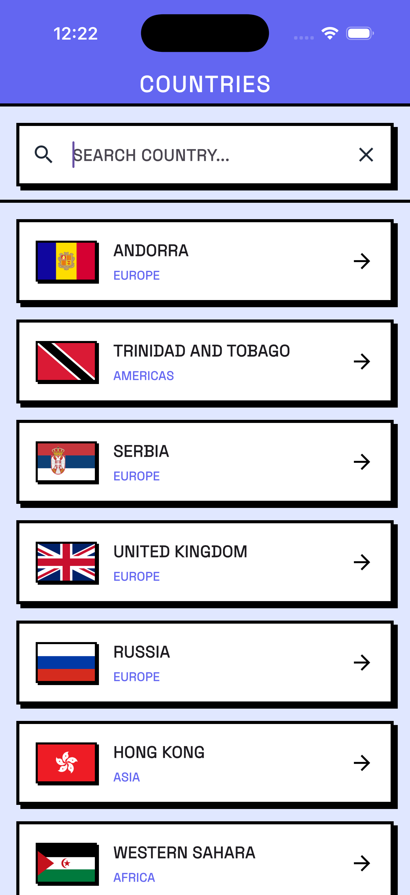
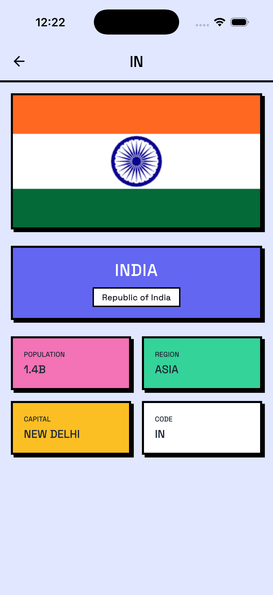

# Netrofit Demo App

A complete Flutter application demonstrating the Netrofit HTTP client package with real-world API integration.

## Features

- ✅ **REST API Integration** - Fetches data from REST Countries API
- 🔍 **Real-time Search** - Filter countries by name, capital, or region
- 📱 **Detail View** - Tap any country to see detailed information
- 🎨 **Material Design 3** - Modern, beautiful UI
- ⚡ **Type-safe API** - Fully generated API client with compile-time safety
- 🛡️ **Error Handling** - Robust error handling with ApiResult pattern

## Screenshots

| List Page | Details Page |
|-----------|--------------|
|  |  |

## Setup Instructions

### Prerequisites

Before you begin, ensure you have:
- **Flutter SDK** (3.0.0 or higher) - [Install Flutter](https://flutter.dev/docs/get-started/install)
- **Dart SDK** (3.0.0 or higher) - Comes with Flutter
- **IDE**: VS Code or Android Studio with Flutter/Dart plugins

### Step 1: Clone or Create Project

If you're setting up this demo:
```bash
# Navigate to the demo_app directory
cd demo_app
```

### Step 2: Install Dependencies

```bash
flutter pub get
```

This will install:
- `netrofit_all` - The complete Netrofit package
- `json_annotation` & `json_serializable` - For JSON serialization
- `build_runner` - For code generation

### Step 3: Run Code Generation

**IMPORTANT**: You must run code generation to create the API implementation files.

```bash
# Clean previous builds (optional but recommended)
dart run build_runner clean

# Generate code
dart run build_runner build --delete-conflicting-outputs
```

**What this does:**
- Generates `countries_api.netrofit.g.part` from `@RestApi` annotations
- Generates `country.g.dart` from `@JsonSerializable` annotations
- Creates type-safe API client implementation

**Note**: The generated file will be `.netrofit.g.part` which needs to be renamed to `.netrofit.g.dart`:
```bash
mv lib/api/countries_api.netrofit.g.part lib/api/countries_api.netrofit.g.dart
```

### Step 4: Run the App

```bash
# List available devices
flutter devices

# Run on a specific device
flutter run -d <device-id>

# Or just run on the default device
flutter run
```

## Project Structure

```
demo_app/
├── lib/
│   ├── api/
│   │   ├── countries_api.dart           # API definition with @RestApi
│   │   └── countries_api.netrofit.g.dart # Generated implementation
│   ├── models/
│   │   ├── country.dart                  # Data model with @JsonSerializable
│   │   └── country.g.dart                # Generated JSON serialization
│   ├── pages/
│   │   └── country_detail_page.dart      # Detail view screen
│   └── main.dart                         # App entry point with search
├── pubspec.yaml                          # Dependencies
└── README.md                             # This file
```

## How It Works

### 1. Define Your API

```dart
@RestApi(baseUrl: 'https://restcountries.com/v3.1')
abstract class CountriesApi {
  factory CountriesApi({required HttpAdapter httpAdapter}) = _$CountriesApiImpl;

  @Get('/all?fields=name,capital,region,population,flags,cca2')
  Future<ApiResult<List<Country>>> getAllCountries();
}
```

### 2. Define Your Models

```dart
@JsonSerializable()
class Country {
  final CountryName name;
  final List<String>? capital;
  final String region;
  final int population;
  final CountryFlags flags;
  final String cca2;
  
  // ... constructor and JSON methods
}
```

### 3. Initialize the API

```dart
final httpAdapter = HttpPackageAdapter(
  interceptors: [LoggingInterceptor(level: LogLevel.basic)],
);
final api = CountriesApi(httpAdapter: httpAdapter);
```

### 4. Make API Calls

```dart
final result = await api.getAllCountries();

result.when(
  success: (countries) {
    // Handle success
    print('Loaded ${countries.length} countries');
  },
  failure: (error) {
    // Handle error
    print('Error: ${error.message}');
  },
);
```

## Troubleshooting

### Issue: "Can't use 'countries_api.netrofit.g.dart' as a part"

**Solution**: Run code generation and rename the file:
```bash
dart run build_runner build --delete-conflicting-outputs
mv lib/api/countries_api.netrofit.g.part lib/api/countries_api.netrofit.g.dart
```

### Issue: "The method 'jsonDecode' isn't defined"

**Solution**: Add `dart:convert` import to your API file:
```dart
import 'dart:convert';
```

### Issue: Build runner completes with "0 outputs"

**Solution**: 
1. Clean the build cache: `rm -rf .dart_tool/build`
2. Run build again: `dart run build_runner build --delete-conflicting-outputs`
3. Rename the generated `.part` file to `.g.dart`

### Issue: "No countries found" or empty list

**Solution**: Check your internet connection and ensure the API endpoint is accessible.

## Features Walkthrough

### Search Functionality
- Type in the search bar to filter countries in real-time
- Search works across country names, capitals, and regions
- Clear button appears when text is entered

### Detail View
- Tap any country card to see detailed information
- View official name, capital, region, population, and country code
- See high-quality flag images

### Error Handling
- Network errors are caught and displayed with a retry button
- Loading states show a progress indicator
- Empty states show helpful messages

## Learn More

- [Netrofit Documentation](../README.md)
- [REST Countries API](https://restcountries.com/)
- [Flutter Documentation](https://flutter.dev/docs)

## License

This demo app is part of the Netrofit package and follows the same license.
